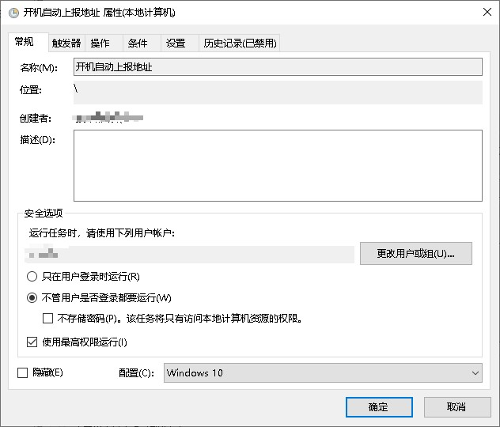

#wol唤醒PC的网页版
一个简单的网页版wol唤醒PC的工具，带有获取IPV6地址的功能。(需要在电脑开机后，自动发送ip到指定地址)

## 使用方法

1. 在电脑上安装node.js
2. 更改src/service/hostList.ts中的hostList为你需要唤醒的电脑的MAC地址和IP地址（可添加多个）

```typescript
export const hostList: HostList[] = [
  {
    hostname: 'jsb-xin', // 电脑的主机名
    mac: '18:C0:4D:A5:83:65', // 电脑的MAC地址
    ip: '192.168.188.100', // 电脑的IPv4地址
    name: '嗷嗷', // 电脑的名称(用于显示)
  },
  // ......
];
```

3. 运行`npm i`，安装依赖
4. 运行`npm run build`，编译，编译后的文件在dist文件夹中
5. 运行`node dist/index.js`，启动服务，服务默认监听7000端口（可在src/index.ts中更改，更改完后重新执行第4步编译）
6. 在浏览器中打开`http://localhost:7000`，即可看到唤醒列表
7. 点击唤醒按钮，即可唤醒电脑

## 说明

如果需要在电脑开机后，自动发送IPV6到网页，可以使用以下方法：.首先要在电脑上配置脚本，以windows10为例，脚本见[sendipv6.ps1](sendipv6.ps1)文件,记得改里面的ip为你的脚本所在的ip，主机名（需要跟上方），然后添加在计划任务中，设置为执行脚本。（详见下方图片，我的环境是windows10）

如果你要自己写脚本，需要发送本机的IPV6列表，和主机名，post到/Ipv6,格式如下：

```json
{
  "hostname": "jsb-xin",
  "ipv6": [
    "fe80::c0a8:bc64:8c6f:8c65",
    "240e:38:6d:8c00:8c65"
    //.....
  ]
}
```

记得在系统内添加静态arp，不然可能会无法唤醒（方法百度）。
我的是ubuntu

```bash
    ip neigh add 192.168.188.100 dev eth0 lladdr 18:C0:4D:A5:83:65
```

####我的计划任务配置（windows10系统）：#####常规页：
 #####触发器页：
全部触发器（添加多个提高成功率）

启动时触发器

网络连接时触发器

DHCPV6客户端地址配置时触发器
 #####操作页：

